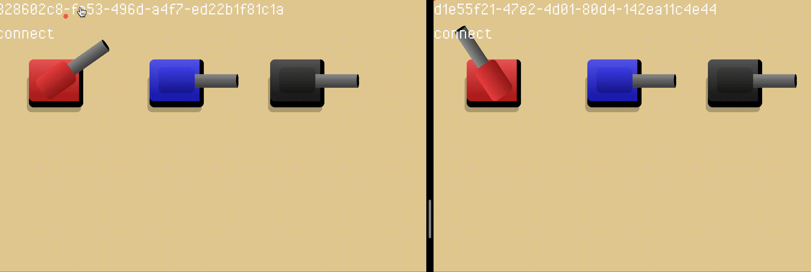
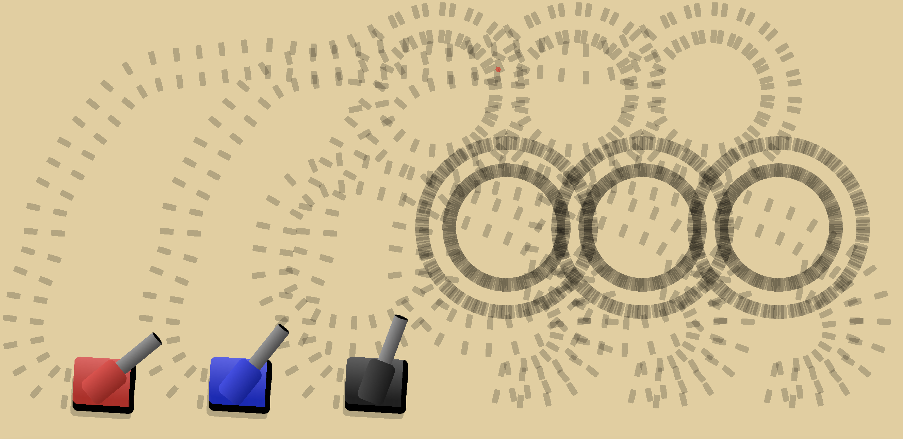

# Tanks

[Haxe](https://github.com/HaxeFoundation/haxe/), [Heaps](https://github.com/HeapsIO/heaps), [WebRTC](https://github.com/feross/simple-peer) and [Differ](https://github.com/snowkit/differ)

<p align="center"></p>

# Quick run

execute index.html with any modern browser

<p align="center"></p>

# Compiling

* Need Haxe 4.2+

* Need Npm

```sh
sh install.sh
```
```sh
haxe build.hxml
```
```sh
npm install
```
```sh
npm start
```